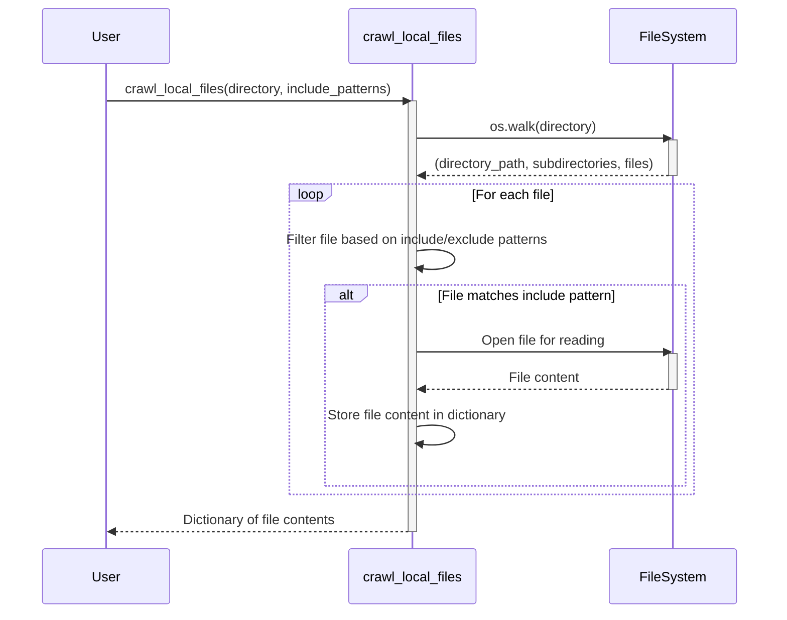

# Chapter 1: Crawling Workflow


[Previous Chapter: Core Abstraction](core_abstraction.md)

Imagine you're a web spider, systematically exploring a website to gather all its pages. That's essentially what we're doing when we "crawl" a directory of files. This chapter introduces the `crawl_local_files` abstraction, a tool to systematically explore a directory and extract the contents of files, with the ability to filter which files are processed based on patterns.

Let’s say you’re building a simple documentation generator. You need to gather all the `.py` and `.md` files within your project directory to create a website. The `crawl_local_files` abstraction allows you to easily achieve this, while automatically excluding files and directories you don't want to include (like build artifacts or version control directories).

### Key Concepts

1.  **Directory Traversal:** Walking through a directory structure, visiting each file and subdirectory.
2.  **File Filtering:** Selecting which files to process based on patterns (e.g., include only `.py` files).
3.  **Exclusion Patterns:** Defining patterns for files and directories that should be ignored during traversal (e.g., `.git/` directory for version control).
4.  **Relative Paths:** Representing file paths relative to the starting directory.

### Using the `crawl_local_files` Abstraction

Here's how you can use the `crawl_local_files` abstraction to gather all `.py` and `.md` files from the current directory:

```python
from utils.crawl_local_files import crawl_local_files

files_data = crawl_local_files(
    ".", # Current directory
    include_patterns={".py", ".md"}
)

print(f"Found {len(files_data['files'])} files.")
for path in files_data["files"]:
    print(f"  {path}")
```

This code snippet calls the `crawl_local_files` function, specifying the current directory (".") and the desired file types (`.py` and `.md`). The result is a dictionary containing the contents of the processed files. The script then prints the number of files found and lists their paths.

### Internal Implementation

Let’s dive into how `crawl_local_files` works.

1.  **Directory Walking:** The code uses `os.walk` to traverse the directory tree.  `os.walk` returns a sequence of tuples, each representing a directory. The tuple contains the path to the directory, a list of subdirectories, and a list of files.

2.  **`.gitignore` Integration:** The code checks if a `.gitignore` file exists. If found, it parses the file and integrates the defined patterns to exclude files and directories.

3.  **Filtering:** The code filters the files based on the `include_patterns` argument. It checks if the filename matches any of the specified patterns. If it does, the file is included; otherwise, it's skipped. The code also respects `exclude_patterns`.

4.  **File Content Extraction:** The code opens each included file in read mode (`"r"`) and reads its contents using `f.read()`. The content is then stored in a dictionary with the relative path as the key.

Here’s a simplified sequence diagram showing the overall flow when `crawl_local_files` is called:



The `crawl_local_files` function takes the directory path and a set of file patterns to include as input. It walks the directory tree, checks each file against the inclusion and exclusion patterns, and if the file matches the inclusion patterns, it reads the content of the file. Finally, the function returns a dictionary containing the relative paths of the included files as keys and their content as values.

Here's the simplified code from `utils/crawl_local_files.py`:

```python
import os

def crawl_local_files(directory, include_patterns=None):
    """Crawls a directory, including only files matching the include_patterns."""
    files_dict = {}
    for root, _, files in os.walk(directory):
        for file in files:
            if include_patterns and any(file.endswith(pattern) for pattern in include_patterns):
                filepath = os.path.join(root, file)
                with open(filepath, "r") as f:
                    content = f.read()
                files_dict[os.path.relpath(filepath, directory)] = content
    return {"files": files_dict}
```

This snippet demonstrates the core logic: it iterates through the files in the directory and its subdirectories.  If a file's name ends with any of the patterns in `include_patterns`, its content is read and stored in the `files_dict`. The path relative to the starting directory is used as the key.

### Conclusion

This chapter introduced the `crawl_local_files` abstraction, a powerful tool for systematically exploring directories and extracting file contents.  By understanding the key concepts of directory traversal, file filtering, and relative paths, you can efficiently gather and process files for various tasks like documentation generation or code analysis.

[Next Chapter: File Content Processing](file_content_processing.md)

---

Generated by [AI Codebase Knowledge Builder](https://github.com/The-Pocket/Tutorial-Codebase-Knowledge)