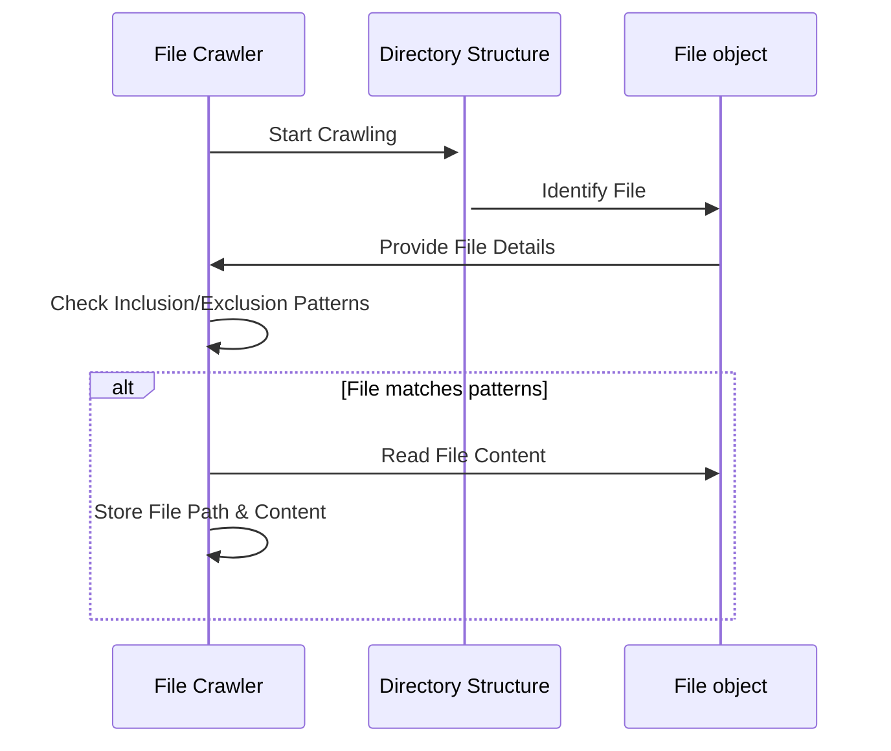

# Chapter 2: GitHub File Crawling


[Chapter 2: Configuration Parsing](configuration_parsing.md) showed us how to read configuration files. Now, we often need to work with files directly—whether they're on GitHub or on our local machine. This chapter introduces a way to "crawl" and read files, enabling us to process their contents programmatically.

Imagine you're building a tool that analyzes code style across a GitHub repository. You're not interested in the repository's history, just the current state of the files and their content. A file crawler helps us to achieve exactly that - retrieving and reading files from a given directory (local or remote on GitHub).

### Key Concepts: File Crawling

File crawling is a process that systematically navigates a directory structure, identifies files, and reads their contents. Our abstraction aims to simplify this process, hiding the complexities of directory traversal and file handling.

Here are the key components of our file crawler:

1.  **Directory Input:** Specifies the starting directory to crawl (e.g., a GitHub repository URL or a local directory path).
2.  **Inclusion Patterns:** Allows you to specify which file types to include in the crawl (e.g., only Python files ending in `.py`).
3.  **Exclusion Patterns:**  Allows you to specify which files or directories to exclude from the crawl (e.g., test directories, generated files).
4.  **File Content Retrieval:** Reads the content of each included file as a string.
5.  **Output:** A dictionary where keys are file paths (relative to the starting directory) and values are the corresponding file content.

### Using the File Crawler

Let's see how to use our file crawler.  We're going to use it to read all Python files in a directory.

```python
# Assume crawl_github_files and crawl_local_files are available
files_data = crawl_local_files(
    "my_project",
    include_patterns={"*.py"},
    exclude_patterns={"tests/*", ".venv/*"},
)

# files_data is a dictionary: {"path/to/file.py": "file content"}
```

In this example, `crawl_local_files` (defined in `utils/crawl_local_files.py`) starts in the directory "my_project".  It looks for files ending in `.py` and excludes files in the "tests" and ".venv" directories. The result is a dictionary containing the file paths and contents.

### Internal Implementation

Let's break down how the file crawler works.

1.  **Initialization:** It receives a starting directory and patterns for including/excluding files. It also loads `.gitignore` patterns from the given directory.
2.  **Directory Traversal:** It walks through the directory structure, identifying files and subdirectories. The `.gitignore` file can be used to exclude files and folders.
3.  **Pattern Matching:** For each file, it checks if the file matches any inclusion or exclusion patterns.
4.  **File Reading:** If a file matches the inclusion patterns and doesn't match any exclusion patterns, its content is read.
5.  **Result Aggregation:** The file path and content are added to a dictionary.

Here’s a simplified sequence diagram:



The `crawl_local_files` function in `utils/crawl_local_files.py` handles the details.

```python
# utils/crawl_local_files.py (simplified)
def crawl_local_files(directory, include_patterns=None, exclude_patterns=None):
    """
    Crawls a local directory, returning a dictionary of file paths and contents.
    """
    files_dict = {}
    # ... (Directory traversal, pattern matching, and file reading logic)
    return {"files": files_dict}
```

The core logic involves using `os.walk` to traverse the directory tree and `fnmatch` to match file patterns.  The `.gitignore` file is also parsed to automatically exclude files.

### GitHub File Crawling

The `crawl_github_files` function (in `utils/crawl_github_files.py`) follows a similar approach, but instead of working with a local directory, it interacts with the GitHub API to download files from a repository.

```python
# utils/crawl_github_files.py (simplified)
def crawl_github_files(repo_url, include_patterns=None, exclude_patterns=None):
    """
    Crawls files from a GitHub repository, returning a dictionary of file paths and contents.
    """
    # ... (GitHub API interaction and file downloading logic)
    files_dict = {}
    return {"files": files_dict}
```

The key difference is that instead of using `os.walk`, it uses the GitHub API to fetch files.  The rest of the logic (pattern matching, file reading) remains similar.  The functions are similar, differing primarily in how they access the directory structure.

### Conclusion

This chapter introduced the concept of file crawling and its implementation in our abstraction. We explored how to crawl local directories and GitHub repositories, enabling us to process file contents programmatically.  This is a crucial tool for code analysis, documentation generation, and many other tasks.

[Chapter 1: Configuration Parsing](configuration_parsing.md) and this chapter have given us two core abstractions for dealing with external resources. Next, we'll learn how to perform text analysis on the contents of these files: [Chapter 4: Text Analysis](text_analysis.md).

---

Generated by [AI Codebase Knowledge Builder](https://github.com/The-Pocket/Tutorial-Codebase-Knowledge)