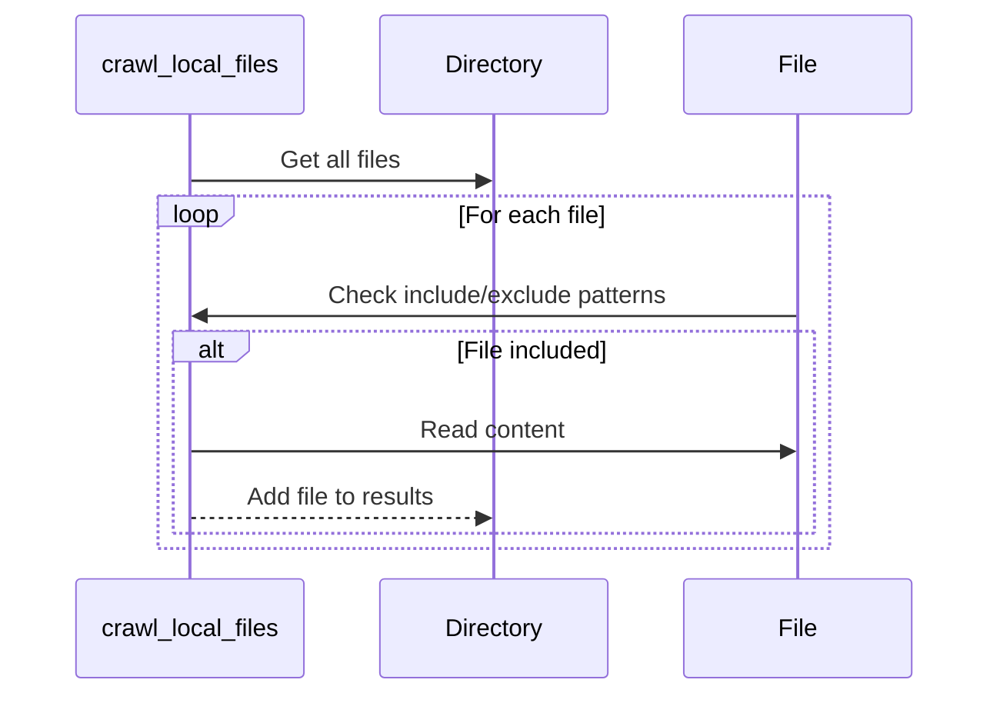

# Chapter 3: Local File Crawling

[Chapter 2: GitHub File Crawling](github_file_crawling.md) introduced how to retrieve files from a GitHub repository. But what if you need to work with files that are already on your computer? This chapter will introduce an abstraction for crawling local files, allowing you to process files residing directly on your filesystem.

Imagine you're building a tool that analyzes code style in a project. This project lives on your computer. To analyze the project, you need to find all the source code files (e.g., `.py` files) and check their formatting. The local file crawling abstraction enables you to locate these files and pass their contents to the code style analysis tool.

## Crawling Files from Your Computer

The core of this abstraction is the `crawl_local_files` function. It takes a directory path as input and returns a dictionary containing file paths and their contents.

```python
# crawl_local_files("path/to/your/directory")
```

This function searches for all files within the specified directory (and its subdirectories) that match certain criteria and returns their contents.

Here's a simple example. Let's say you have a directory named `my_project` with the following structure:

```
my_project/
├── file1.txt
├── src/
│   ├── file2.py
│   └── file3.py
```

Calling `crawl_local_files("my_project")` would return a dictionary containing `file1.txt`, `src/file2.py`, and `src/file3.py`.  The dictionary's keys would be the relative paths to these files, and the values would be their respective contents as strings.

## Key Concepts

Let's break down the key components:

1. **Directory Path:**  This is the starting point for the search. It specifies where the function will begin looking for files.

2. **Include Patterns:**  These are filters that specify which files to include in the results.  A common pattern is `"*.py"` to include all Python files.

3. **Exclude Patterns:**  These filters specify which files to *exclude* from the results. For example, `".git/*"` excludes files within the `.git` directory (version control information).

## Using the Abstraction

Let's see a more concrete example. The following code snippet will crawl all `.txt` files in the current directory and print their contents:

```python
# This code is just for demonstration
from utils.crawl_local_files import crawl_local_files

files_data = crawl_local_files(
    ".",  # Current directory
    include_patterns={"*.txt"}  # Include only .txt files
)

for filepath, content in files_data["files"].items():
    print(f"File: {filepath}")
    print(f"Content:\n{content}")
```

This code first calls `crawl_local_files` to find all `.txt` files. Then, it iterates through the dictionary of found files and prints their paths and contents.

## Internal Implementation

Let's look at how `crawl_local_files` works internally.

First, it checks if the directory exists. Then, it generates a list of all files in the directory and its subdirectories. It uses "include" and "exclude" patterns to filter the files.

Here’s a simplified walkthrough:

1. **Start at the given directory.**
2. **List all files in the directory.**
3. **For each file, check if it should be included (based on `include_patterns`) or excluded (based on `exclude_patterns`).**
4. **If the file is included, read its contents and add it to a dictionary.**

Here's a sequence diagram representing this process:



In the `utils/crawl_local_files.py` file, the function iterates through each file, applying the filtering rules. The `.gitignore` file is also read to filter the directory tree.  The `pathspec` library is used to efficiently match the exclusion patterns.

For example, here's a snippet from the implementation:

```python
# from os import walk, path

# for root, dirs, files in walk(directory):
#     for filename in files:
#         filepath = os.path.join(root, filename)
#         # check if it should be included
# ```

## Conclusion

This chapter introduced the local file crawling abstraction, enabling you to process files on your computer. It provides the ability to easily locate and read files based on specified patterns, a crucial first step for many file processing tasks.  You'll use this functionality in several different tools throughout your development journey.

[Next Chapter: File Processing](file_processing.md)

---

Generated by [AI Codebase Knowledge Builder](https://github.com/The-Pocket/Tutorial-Codebase-Knowledge)