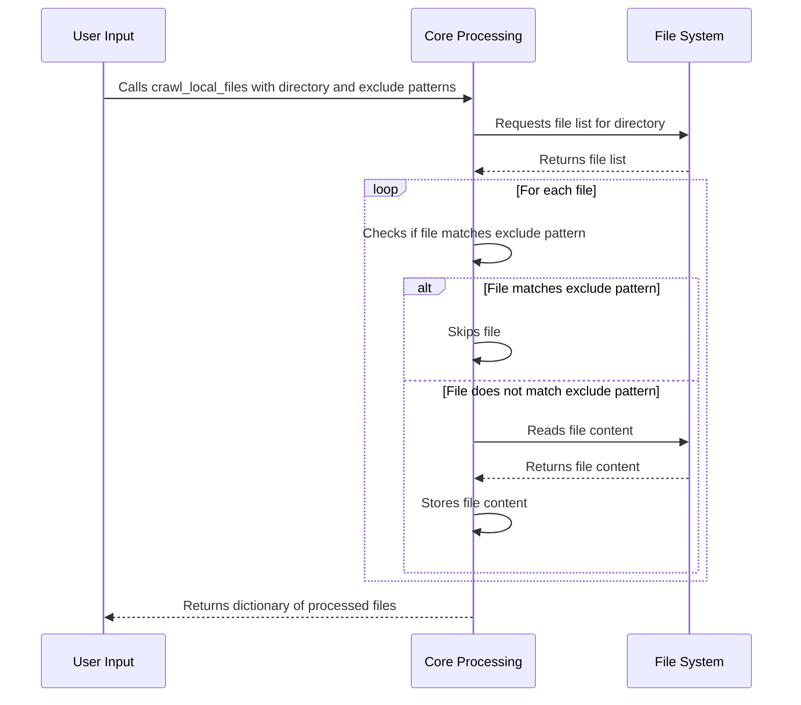

# Chapter 4: File Inclusion/Exclusion Rules

[Previous Chapter: API Client](api_client.md)

Imagine you're building a documentation generator. You want to process all `.py` files in a project, but you *don't* want to include test files, or files inside a `venv` (virtual environment) directory.  That's where file inclusion and exclusion rules come in! This chapter will show you how to control *which* files are processed.

## The Problem: Processing Only Relevant Files

Often, a project contains files you *don't* want to include when you're generating documentation, building a project, or running a particular process.  For example, you might have:

*   Test files (e.g., `test_*.py`)
*   Virtual environment files (e.g., `venv/*`)
*   Generated files (e.g., `*.pyc`)
*   Internal configuration files.

You need a way to specify which files to include and exclude.

## The Solution: Inclusion/Exclusion Rules

We can define rules that specify file patterns.  These patterns tell the system which files to include and which to exclude. The patterns use something called *wildcards*, which are special characters that match multiple files.

*   `*`: Matches any characters.
*   `?`: Matches a single character.

For instance:

*   `*.py`: Matches all files ending with `.py`.
*   `test_*.py`: Matches files like `test_main.py`, `test_utils.py`.
*   `venv/*`: Matches all files and directories inside the `venv` directory.

## Using the `crawl_local_files` Abstraction

We're going to use the `crawl_local_files` abstraction we defined earlier. This abstraction already supports including and excluding files based on patterns. Here's how you're going to use it.

```python
from utils.crawl_local_files import crawl_local_files

files_data = crawl_local_files(
    "..",
    exclude_patterns={
        "*.pyc",
        "__pycache__/*",
        ".venv/*",
        ".git/*",
        "docs/*",
        "output/*",
    },
)
```

This code snippet shows how to call `crawl_local_files`, providing a list of files we want to *exclude* from processing.  The `".."` argument tells the function to start crawling from the parent directory.

This code will crawl the parent directory, and skip files with extensions `.pyc`, files within the `__pycache__` directory, files within the `.venv` directory, git related files and the `docs` and `output` directories.

## Internal Implementation Walkthrough

Let's break down what's happening inside the `crawl_local_files` function.

**1.  Initialization:**

The function starts by setting up a dictionary to store the processed files and, optionally, loads `.gitignore` patterns to exclude files.

**2.  File Traversal:**

The function walks through the specified directory, listing all files and directories. For each directory, it checks if that directory is excluded by `.gitignore` or the `exclude_patterns` that we passed.

**3. Inclusion/Exclusion Checks**

For each file, the function checks if it is excluded according to:

1. `.gitignore`: If a file or directory matches a pattern in the `.gitignore` file, it is excluded.
2. `exclude_patterns`: If a file matches any of the patterns we provided in the `exclude_patterns` list, it is excluded.
3. `include_patterns`: if specified, a file needs to match one of the `include_patterns` in order to be included.

**4. File Processing:**

If a file is *not* excluded, the function reads the file's content and stores it in the dictionary.

**Sequence Diagram**



This diagram summarizes how the `crawl_local_files` function interacts with the file system to process files based on exclusion rules.

**Code Snippet (Simplified Reading File Content)**

```python
# (Inside the crawl_local_files function)
try:
    with open(filepath, "r", encoding="utf-8") as f:
        content = f.read()
```

This simple code snippet reads the content of a file specified by `filepath` and assigns it to the `content` variable.  The `with` statement ensures the file is properly closed after reading.

## Conclusion

This chapter explained how to include and exclude files when crawling a directory, using file patterns.  The `crawl_local_files` abstraction provides a simple way to specify which files to process.

[Next Chapter: Configuration File Parsing](configuration_file_parsing.md)

---

Generated by [AI Codebase Knowledge Builder](https://github.com/The-Pocket/Tutorial-Codebase-Knowledge)