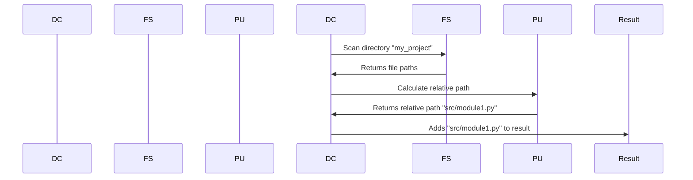

# Chapter 5: Relative Path Handling

Following our ability to filter files based on exclusion patterns, let's tackle a common scenario: working with relative paths. Sometimes, you don't want the full, absolute path to a file; you just want the path relative to a starting directory. This is especially useful for portability and cleaner project structures.

Imagine you're building a documentation generator. You want to include files from different subdirectories, but you don’t want your generated documentation to include the full path to your project's root. You just want paths like `src/module1.py` or `docs/index.md`.  This chapter explains how our abstraction handles relative paths.

### Key Concepts: Relative vs. Absolute Paths

* **Absolute Path:** The full path from the root directory of your file system (e.g., `/Users/user/project/src/module1.py`).
* **Relative Path:** The path relative to a starting directory (e.g., `src/module1.py` if your starting directory is `/Users/user/project`).

Our `crawl_local_files` abstraction now has a new parameter: `use_relative_paths`.  When set to `True` (the default), it provides paths relative to the directory you specified.

### Using Relative Paths

Let's see how to use the `crawl_local_files` abstraction to get relative paths.

```python
files_data = crawl_local_files(
    "my_project",  # Starting directory
    use_relative_paths=True,
)
```

This code snippet calls the `crawl_local_files` function, specifying "my_project" as the starting directory and setting `use_relative_paths` to `True`.  The `files_data` dictionary will now contain file paths relative to "my_project".

Let's modify our previous example:

```python
files_data = crawl_local_files(
    "my_project",  # Starting directory
    use_relative_paths=True,
    exclude_patterns={
        "tests/*",
    },
)
```

If `my_project/src/module1.py` exists, the `files_data` dictionary will contain a key like "src/module1.py" instead of the full absolute path.

### Internal Implementation: How Relative Paths are Generated

Let's walk through the process step by step.

1. **`use_relative_paths=True`**:  The abstraction determines whether to use relative or absolute paths.

2. **Path Construction**: When a file is found during the directory traversal, the code constructs the relative path:

```python
relpath = os.path.relpath(filepath, directory) if use_relative_paths else filepath
```

`os.path.relpath(filepath, directory)` calculates the path relative to the starting directory.  For example, if `filepath` is `/Users/user/project/src/module1.py` and `directory` is `/Users/user/project`, `os.path.relpath` will return "src/module1.py".

Here's a simplified sequence diagram illustrating the process:



### Code Snippets and Explanation

The relevant code resides in `utils/crawl_local_files.py`. Let’s focus on the crucial part:

```python
relpath = os.path.relpath(filepath, directory) if use_relative_paths else filepath
```

This single line determines whether to return a full path or a relative path.  If `use_relative_paths` is `True`, `os.path.relpath` does the magic. Otherwise, the full path is used.

### Conclusion

This chapter explained how to work with relative paths using our abstraction.  The `use_relative_paths` parameter gives you control over whether to get full paths or paths relative to a starting directory. This control enhances portability and simplifies project structures.

Next, we'll explore how to handle files that are potentially very large, and set size limits for crawling. [Configuration File Parsing](configuration_file_parsing.md)

---

Generated by [AI Codebase Knowledge Builder](https://github.com/The-Pocket/Tutorial-Codebase-Knowledge)