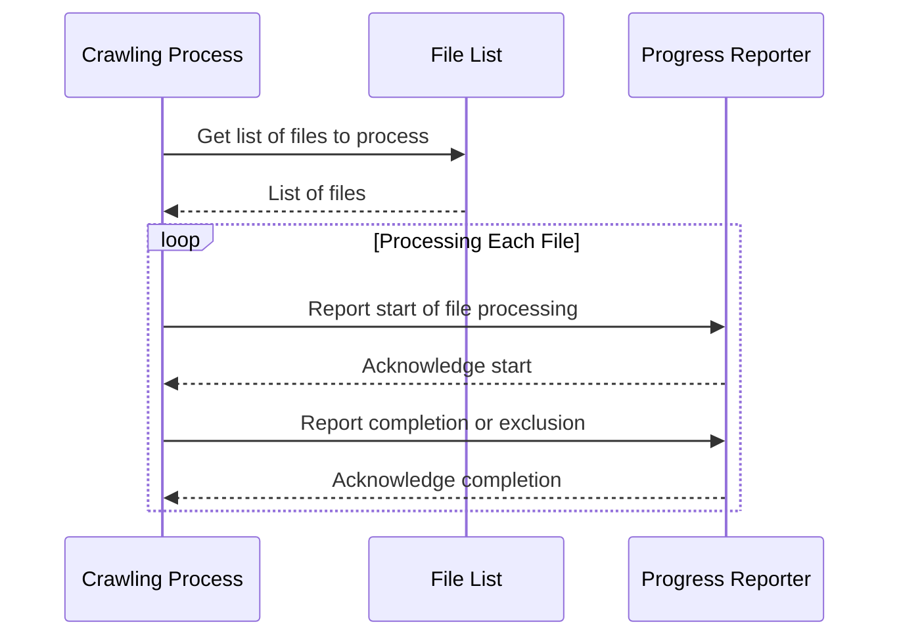

# Chapter 6: Progress Reporting


Following our work on file size limits [Chapter 9: Size Limits](configuration_file_parsing.md), it’s helpful to provide feedback while the code is running.  Imagine you're crawling a very large repository – it would be nice to know how far along the process is. This chapter introduces progress reporting to give users a sense of how long the process will take.

The goal is to print informative messages to the console as files are processed, indicating progress and potential skips (excluded or errored files).  This is especially helpful for large repositories where the crawl might take a considerable amount of time.

### How to Use Progress Reporting

The `crawl_local_files` abstraction already incorporates basic progress reporting. To see it in action, simply run the function. The output will show the file being processed, its status (processed, skipped, or errored), and a percentage indicating how much of the crawl is complete.

Here'll be an example showing how to use it:

```python
files_data = crawl_local_files(
    "..",
    exclude_patterns={
        "*.pyc",
        "__pycache__/*",
        ".venv/*",
        ".git/*",
        "docs/*",
        "output/*",
    },
)
```

This will print progress messages to your terminal as files are crawled. Each line of output will indicate which file is being processed, its status, and the current percentage of the crawl complete.  For example, you might see:

```
Progress: 10/100 (10%) tests/unit/test_example.py [processed]
Progress: 20/100 (20%) tests/integration/test_integration.py [processed]
Progress: 30/100 (30%) docs/conf.py [skipped (excluded)]
```

### Internal Implementation

The core logic for progress reporting is handled within the `crawl_local_files` function.  Let's examine the relevant steps using a sequence diagram.



This sequence shows the Crawling Process getting a list of files to process. Then, for each file it reports to a Progress Reporter.

The progress reporting is accomplished by calculating the percentage of files processed and printing a formatted string to standard output. The `\033[92m` and `\033[0m` sequences add color to the output (green) which improves readability.

The key code snippet that handles progress reporting is within the `crawl_local_files` function itself.

```python
# ... (Inside crawl_local_files function)
if total_files > 0:
    percentage = (processed_files / total_files) * 100
    rounded_percentage = int(percentage)
    print(f"\033[92mProgress: {processed_files}/{total_files} ({rounded_percentage}%) {relpath} [{status}]\033[0m")
```

This section calculates the percentage of files processed and prints it along with the filename and status. The color codes ensure that the output is visually clear, highlighting the progress and any skips.

### Advanced Configuration (Future)

Currently, progress reporting is handled internally. Future enhancements might allow users to customize the format of progress messages or redirect the output to a log file.

### Conclusion

This chapter demonstrated how progress reporting can be integrated into the crawl process, providing valuable feedback to users. By displaying the percentage of files processed and indicating any skips, the abstraction provides a clearer picture of the crawl’s progress. Next, we'll explore how to handle errors more gracefully and make the process more robust. [Chapter 11: Error Handling](configuration_file_parsing.md)

---

Generated by [AI Codebase Knowledge Builder](https://github.com/The-Pocket/Tutorial-Codebase-Knowledge)