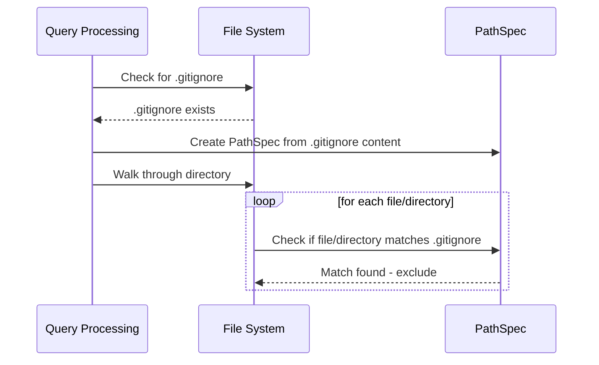

# Chapter 7: `.gitignore` Integration


Following our ability to exclude files based on simple patterns, we now aim to integrate with `.gitignore` files. This allows us to respect existing project configurations regarding which files should be ignored, mirroring Git's behavior. Imagine a project where certain directories, like `node_modules` or `build`, are explicitly listed in `.gitignore`. We want our file crawling abstraction to automatically respect this configuration, preventing unnecessary processing and potentially reducing overhead.

### Understanding .gitignore

A `.gitignore` file is a simple text file in the root of a Git repository that specifies intentionally untracked files that Git should ignore. Each line typically represents a pattern that matches file or directory names. These patterns can include wildcards and can specify paths relative to the `.gitignore` file's location.

### Integrating `.gitignore` in our Abstraction

Our abstraction will now scan for a `.gitignore` file in the target directory. If found, it will parse the file's contents and use the patterns specified within to exclude files and directories during the crawling process. This ensures that the crawling process is consistent with the project's intended behavior as defined by its `.gitignore` file.

### How to Use the Abstraction

To leverage the `.gitignore` integration, simply call the `crawl_local_files` function as usual, without providing any additional parameters related to file exclusion. The abstraction will automatically detect and process the `.gitignore` file if present.

```python
files_data = crawl_local_files(
    "my_project_directory"
)
```

This code will crawl the files in `my_project_directory`, automatically respecting any exclusions defined in its `.gitignore` file. The `files_data` dictionary will contain a list of files that were successfully crawled, excluding those ignored by the `.gitignore` configuration.

### Internal Implementation

Let's break down the steps involved in integrating with `.gitignore`:

1. **Detecting the `.gitignore` File:** The abstraction first checks if a `.gitignore` file exists within the specified directory.

2. **Parsing the `.gitignore` Contents:** If the file exists, it's opened and read.  Each line represents a pattern to ignore.

3. **Converting Patterns to a PathSpec:** We use the `pathspec` library to efficiently match file and directory names against the patterns in the `.gitignore` file.  `pathspec` provides a consistent and robust way to handle wildcards and other special characters commonly used in `.gitignore` files.

4. **Excluding Files and Directories:** During the directory traversal, the abstraction uses the `pathspec` object to check if the current file or directory matches any of the patterns specified in the `.gitignore` file. If a match is found, the file or directory is excluded from the crawling process.

Here's a snippet showcasing the code responsible for reading and utilizing the `.gitignore` content:

```python
import pathspec

# --- Load .gitignore ---
gitignore_path = os.path.join(directory, ".gitignore")
gitignore_spec = None
if os.path.exists(gitignore_path):
    try:
        with open(gitignore_path, "r", encoding="utf-8") as f:
            gitignore_patterns = f.readlines()
        gitignore_spec = pathspec.PathSpec.from_lines("gitwildmatch", gitignore_patterns)
        print(f"Loaded .gitignore patterns from {gitignore_path}")
    except Exception as e:
        print(f"Warning: Could not read or parse .gitignore file {gitignore_path}: {e}")
```

This code block reads the contents of the `.gitignore` file and creates a `pathspec` object. This object allows efficient matching of file and directory names against the patterns defined in the `.gitignore` file. The `gitwildmatch` parameter specifies that the patterns in the `.gitignore` file should be interpreted as Git wildcards.

Here's a sequence diagram illustrating the process:



The diagram shows how the query processing component checks for a `.gitignore` file, creates a `PathSpec` object from its content, and uses it to exclude files and directories during the directory traversal. The `PathSpec` object efficiently handles wildcard matching and ensures that files and directories are excluded in accordance with the patterns defined in the `.gitignore` file.

### Summary

By integrating with `.gitignore` files, our abstraction allows us to respect existing project configurations and ensure that only the intended files are processed. This feature enhances the flexibility and usability of our abstraction, making it a valuable tool for managing file crawling operations in various projects.

Next, we're going to discuss error handling to create a more robust abstraction. [Chapter 11: Error Handling](configuration_file_parsing.md)

---

Generated by [AI Codebase Knowledge Builder](https://github.com/The-Pocket/Tutorial-Codebase-Knowledge)